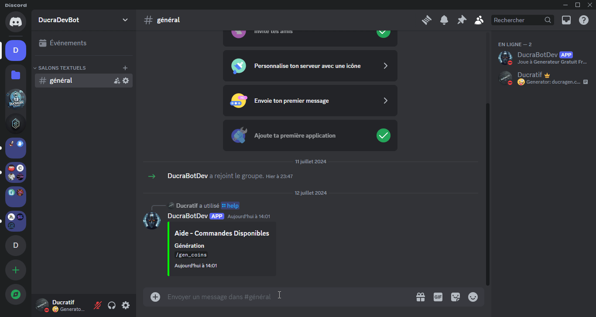

# Generation Solde

Télécharger/Download: [https://github.com/Ducratif/Generation-Solde](https://github.com/Ducratif/Generation-Solde)

Cette commande fait référence a la requête [Generation par solde](../exemple-json/generation-par-solde.md).

Aller dans le dossier nommer config.json puis ajouter les informations demander.

<pre class="language-json"><code class="lang-json">{
    "token": "TOKEN_BOT",
    "serverid": "SERVEUR_ID",
    "botid": "ID_BOT",

    "channel_gen": "CHANNEL_GEN_ID",

    "api_key_user": "CLE_API_DUCRAGEN",
    
<strong>    "plan": "1",
</strong>    "_comment1": "Free: 1 | Basique: 2 | Standard: 3 | Premium: 4",
    
    "url_api": "https://api.ducragen.com/",
    "_comment": "NE PAS TOUCHER A L'URL DE L'API"
    
  }
</code></pre>

Pour plan changer par 1/2/3/4 selon les services que vous voulez.

Une fois toute les informations ajouter, dans votre terminal faite la commande:

```
node deployCommands.js
```

Cela va crée les commandes disponible dans le fichier nommer: `/commands`

Une fois toute les actions précédente effectuer sans encombre, démarrer votre bot via la commande depuis votre terminal:

```
node . ou node index.js
```

<figure><figcaption></figcaption></figure>
