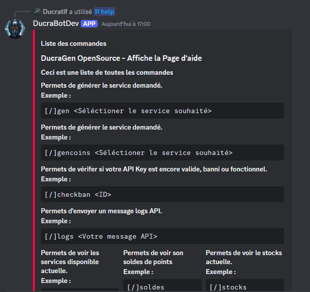

# OpenSource

Installer NodeJS & VS Code pour une meilleur utilisation.

Installer l'open source depuis Github: [Télécharger](https://github.com/Ducratif/Ducragen-Bot-Discord/tree/main)

Aller dans le fichier config.js

Puis modifier les informations du fichier par vos informations.

```javascript
token: 'TOKEN', // Mettre le token de votre Bot.
prefix: '!', // Le préfixe pour les commandes de votre bot.
id_bot: "ID_BOT", // Mettre l'ID de votre Bot.
cles_api: "CLES_API", // Mettre votre clé API DucraGen.
lien_API: "https://api.ducragen.com/", // Lien de l'API DucraGen.
abbonements: "premium", // Choisissez entre "free", "basique", "standard", "premium".
plan: "1", // Plan associé à l'abonnement.
Nom_Du_BOT: "DucraGen OpenSource", // Nom du bot.
Proposer_Par: "DucraGen OpenSource", // Propriétaire ou source du bot.
ServeurID: "ID_SERVEUR", // Mettre l'ID de votre serveur où se situe votre bot.
```

Une fois cela fait, aller dans le terminal de commande, puis faite <mark style="color:orange;">**npm install**</mark>

Attendez que toute les installations des modules sois effectué avant de continuer.

Une fois fait, démarrer le bot, puis inviter le sur votre serveur.


<figure><figcaption></figcaption></figure>

<figure><figcaption></figcaption></figure>
