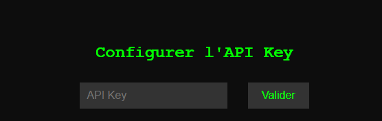
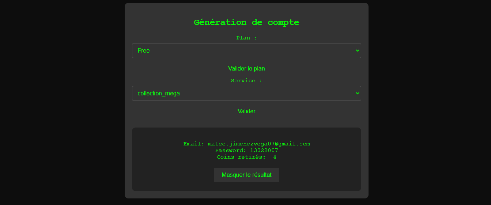

# Generation

### Configuration

[Télécharger la source depuis Github](https://github.com/Ducratif/Generator-PHP)

Une fois fait, récuperer votre Clé API depuis le lien suivant: [Dashboard=>API](https://ducragen.com/api.php)

Ajouter la puis validé

<figure><figcaption></figcaption></figure>

Ensuite ajouter votre ID Discord lié à votre compte DucraGen

<figure><figcaption></figcaption></figure>

Une fois validé, ce message va s'afficher, il faudra cliquer sur le bouton pour aller au Dashboard, puis par la suite supprimer bien le fichier index.php pour éviter que l'on supprimer votre configuration si votre site est en public.

<figure><figcaption></figcaption></figure>

Une fois sur le Dashboard, vous verrez votre ID discord, ainsi que votre nombre de coins que vous avez sur votre compte.

En bas vous avez un bouton `Génération de compte`

Cliquez dessus, puis vous pourrez sélectionner un plan ainsi que le service souhaitez à générer.

<figure><figcaption></figcaption></figure>

### Supprimez la configuration

Il vous suffira d'ajouter le fichier index.php supprimer précédément, et cliquer sur le bouton `Supprimer la configuration`
